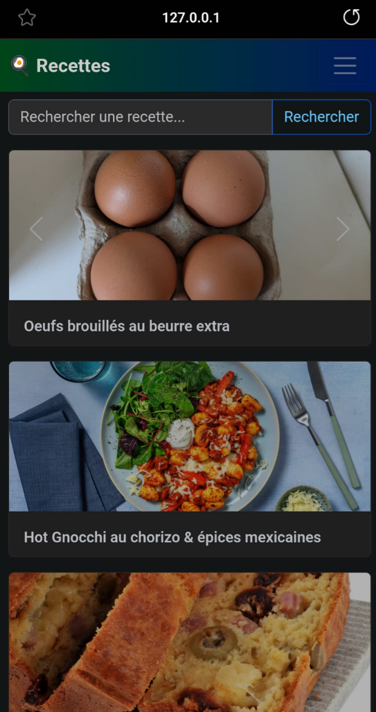

## Concept

- Ajoute, modifie et gère tes recettes depuis ton téléphone ou ton ordinateur.
- Importe automatiquement des recettes HelloFresh ou Marmiton en collant simplement un lien.
- Les photos peuvent être locales ou sur le web, affichées dans un joli carrousel.
- Recherche par nom, ingrédient ou notes.
- Tout est stocké dans un simple fichier JSON (TinyDB).
- Interface adaptée au mobile, facile à utiliser partout.

## Fonctionnalités

- **Ajouter une recette** : Remplis le formulaire, télécharge une photo, ajoute les ingrédients.
- **Importer depuis une URL** : Colle un lien HelloFresh ou Marmiton, les ingrédients et la photo sont récupérés pour toi.
- **Modifier une recette** : Change le nom, les notes, les ingrédients ou la photo.
- **Supprimer une recette** : Retire ce que tu ne veux plus.
- **Recherche** : Trouve des recettes par nom, ingrédient ou notes.
- **Design responsive** : Fonctionne bien sur smartphone.

## Comment lancer

- Installe Python, Flask, TinyDB, BeautifulSoup, Requests.
- Lance `flask run` (voir `start.sh` pour Termux/Android).
- Ouvre dans ton navigateur (ou sur ton téléphone).
- Fais un commit et push git pour mettre à jour le json sur github.
